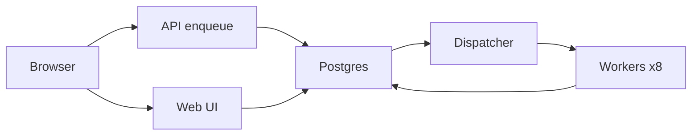
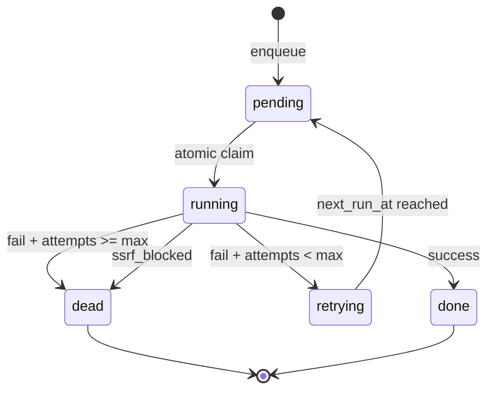
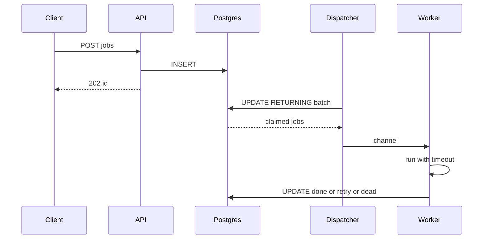
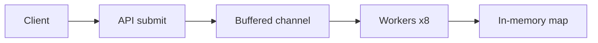
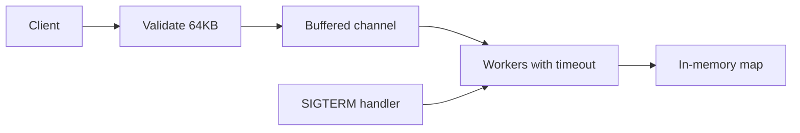
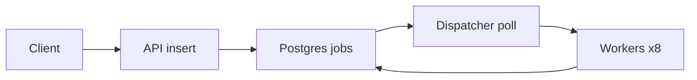
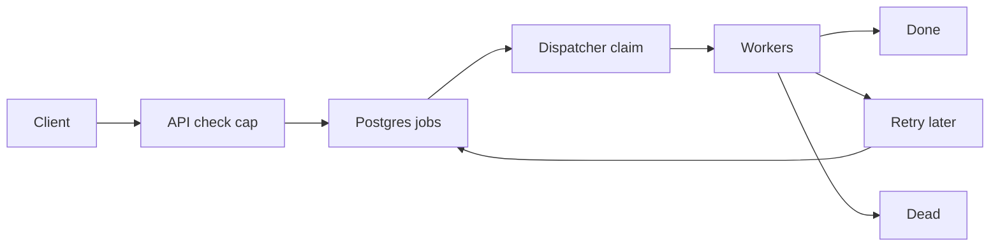
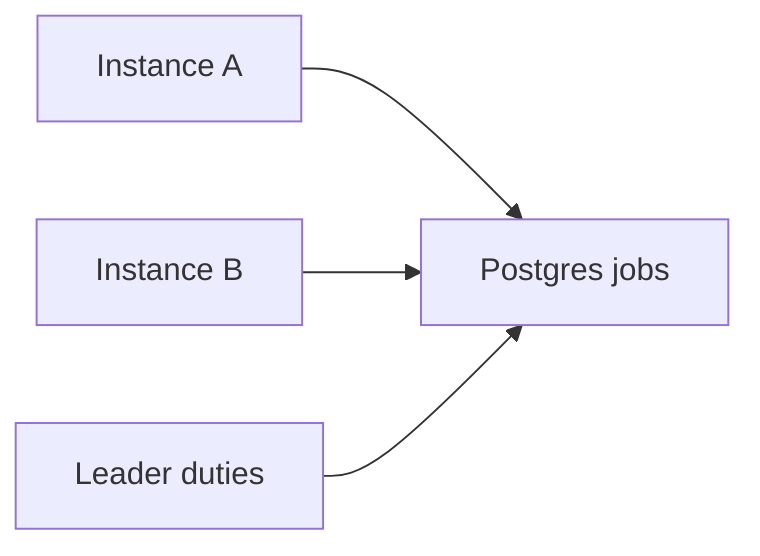
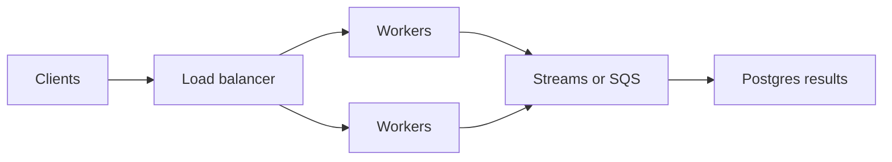

# Go Worker Pool – System Design

A production-shaped background job runner built in Go. This project focuses on **system design maturity** — concurrency, durability, retries, backpressure, and honest trade-offs — rather than just a working demo.

**Live:** TBD

## Goal

Build a worker pool that demonstrates real backend engineering judgment:

- Bounded concurrent execution under write-heavy enqueue load
- Durable job queue that survives restarts
- Clear separation of concerns
- Explicit handling of retries, idempotency, and failure
- A simple, usable web interface — no JavaScript

## Requirements

### Functional

- Enqueue a job for async execution
- Query job status and result by ID
- Retry failed jobs with backoff, then park in DLQ
- Idempotent enqueue via client-supplied key
- Simple web UI for submitting and browsing jobs

### Non-Functional

- Bounded concurrency, never unbounded goroutines
- Data survives process restarts
- Backpressure when queue is full, not silent queue growth
- At-least-once execution with idempotent handlers
- Schema changes tracked and reversible via migrations

### Out of Scope (v1)

- Multi-instance consume / scheduler leader election (stretch, designed-only)
- Cron / scheduled jobs
- Priorities and per-user quotas
- User accounts / authentication

## High-Level Architecture

```
Browser
   │
   ├──► Web pages (Go html/template, server-rendered, no JS)
   │
   ▼
Go App Server (API + Dispatcher + Workers, single process)
   │
   └──► PostgreSQL (queue + source of truth)
```

**Core principles:**

- The app server is stateless except for in-flight goroutines
- PostgreSQL is the single source of truth and the queue
- Workers claim jobs with atomic `UPDATE ... RETURNING`, never in-memory only and never select-then-update
- Enqueue is a fast Postgres insert; execution happens async
- The web frontend is a thin BFF layer over the same store — no separate API round-trip

### Flow Charts

Request flow:



Job lifecycle:



Claim + retry sequence:



## Design Evolution

The system was grown in deliberate stages instead of jumping straight to a distributed design. Each stage is bare minimum shippable for that stage — no forward-building. Later stages add via new migrations, not by editing earlier work.

### Stage 1 – MVP

Bare minimum to prove concurrency:

- Single Go process
- `sleep` jobs only `{duration_ms}`
- Buffered channel + fixed pool (`WORKERS=8`), in-memory map + `sync.RWMutex`
- Basic submit + run + status
- No persistence, no retries, no idempotency, no validation beyond JSON shape



### Stage 2 – Single Instance Production

Bare minimum to run `sleep` reliably in one container. Still in-memory, still no Postgres:

- Environment-based configuration, fail-fast on missing config
- Graceful shutdown (`SIGTERM`/`SIGINT`, 30s drain via `WaitGroup`)
- Payload validation + max size 64KB (`413` if over). Unknown `type` → `400` (only `sleep` accepted yet).
- Per-job `context.WithTimeout` (30s). Timeout does not kill goroutines — handlers must check `ctx.Done()`. Otherwise timeout only affects bookkeeping while the goroutine leaks.
- Structured logging (`log/slog` with `job_id, type, attempt`)
- Dockerized, CI/CD via GitHub Actions



### Stage 3 – Durable Storage (PostgreSQL)

Bare minimum to survive restarts. Still `sleep` only, no retries yet — `failed` is terminal.

PostgreSQL is the queue. Schema is managed through versioned migrations (`golang-migrate`) — every change is a new pair under `db/migrations/`, never an edit. `0001_create_jobs` is minimal:

```sql
CREATE TABLE IF NOT EXISTS jobs (
    id          UUID PRIMARY KEY,
    type        TEXT NOT NULL,
    payload     JSONB NOT NULL,
    status      TEXT NOT NULL DEFAULT 'pending',
    result      JSONB,
    last_error  TEXT,
    created_at  TIMESTAMPTZ NOT NULL DEFAULT NOW(),
    updated_at  TIMESTAMPTZ NOT NULL DEFAULT NOW()
);
CREATE INDEX IF NOT EXISTS idx_jobs_claim ON jobs (status, created_at) WHERE status = 'pending';
```

Later changes (retries, idempotency) come as `0002_...`, `0003_...` in Stage 4 — applied with `make migrate-up`, reverted with `make migrate-down`.

Claiming avoids double-run by claiming atomically, not select-then-update in app code. Stage 3 claim is minimal (no `next_run_at` yet — that comes in Stage 4):

```sql
-- Stage 3 atomic batch claim, single round-trip
UPDATE jobs SET status = 'running', updated_at = NOW()
WHERE id IN (
  SELECT id FROM jobs
  WHERE status = 'pending'
  ORDER BY created_at
  FOR UPDATE SKIP LOCKED
  LIMIT 8
)
RETURNING *;
```

Stage 4 replaces it with the retry-aware version filtering `next_run_at <= NOW()` + `ORDER BY next_run_at` after `0002` adds that column.

Polling: `500ms` when batch full, exponential backoff to `2s` when empty. No `LISTEN/NOTIFY` v1 — keeps failure modes single-path. `LISTEN/NOTIFY` is future optimization only.

On boot, any `running` jobs are requeued to `pending` — this closes the crash-mid-execution gap. This is safe only under the single-instance assumption: a fresh process start guarantees no other worker goroutine is still alive. Once multi-instance is introduced this breaks, which is why the stretch goal needs leases / advisory-lock leadership.

**Why PostgreSQL?** Strong consistency, `SKIP LOCKED` for safe concurrent claim, excellent Go support (`pgx`), and enough throughput for v1 without adding Redis Streams / SQS. Redis considered and rejected — Postgres transactional locking fits claim semantics better here; Redis would add a second failure mode with no benefit at this scale.



### Stage 4 – Retries, Idempotency, Backpressure

Bare minimum to handle real I/O. This stage adds `webhook` + `image_resize` (stub), and only here do retries/DLQ appear.

Migration `0002_add_retry_idempotency.up.sql`:

```sql
ALTER TABLE jobs ADD COLUMN attempts INT NOT NULL DEFAULT 0;
ALTER TABLE jobs ADD COLUMN max_attempts INT NOT NULL DEFAULT 5;
ALTER TABLE jobs ADD COLUMN next_run_at TIMESTAMPTZ NOT NULL DEFAULT NOW();
ALTER TABLE jobs ADD COLUMN idempotency_key TEXT UNIQUE;
CREATE INDEX IF NOT EXISTS idx_jobs_retry ON jobs (status, next_run_at) WHERE status = 'pending';
DROP INDEX IF EXISTS idx_jobs_claim;
```

Down reverses it. No table rebuild, no data loss.

Most failures are transient. Retries use exponential backoff with jitter:

- `next_run_at = NOW() + (2^attempts * 1s) + jitter`
- Timeout, webhook non-2xx, panic = retryable until `max_attempts`
- After `max_attempts` → `dead` (DLQ), never silently dropped

**Idempotency:** `idempotency_key UNIQUE`. Duplicate enqueue returns `409` with existing `id`, not a second job. Handlers must also be re-run safe — at-least-once means a job can run twice. Bloat guard: in-process nightly ticker deletes `done/dead` rows older than 30 days (single-instance safe, no external cron); idempotency horizon is therefore 30 days, documented in API.

**Backpressure:** cap `pending + running` at 1000. Cap is approximate under concurrent enqueue — check-then-insert can overshoot by ~worker count. Accepted and documented; a hard cap would require serializing all enqueues. Beyond cap enqueue returns `503 + Retry-After: 5`, counted as `enqueue_rejected_total`.

**DLQ visibility:** `dead` never auto-retried. `/jobs?status=dead` shows DLQ, `/metrics` exposes `dlq_size`. Growth is the poison-pill alarm.

**Webhook SSRF guard (added here with webhook, not earlier):** deny `localhost`, `127.0.0.0/8`, `10.0.0.0/8`, `172.16.0.0/12`, `192.168.0.0/16`, `169.254.169.254`, `::1`. HTTP only, 5s dial + 30s total timeout via `http.NewRequestWithContext`, max 1MB response, max 3 redirects to same-guarded targets. Violation → `dead` with `last_error='ssrf_blocked'`, no retry.

A Postgres outage pauses both enqueue and polling: requests fail fast, nothing is acked that wasn't persisted.



### Stage 5 – Multi-Instance Consume — Planned

Designed, not implemented. Multiple dispatchers would poll the same table with `SKIP LOCKED`; scheduler duties (requeue stuck `running`, DLQ sweep) would run under a Postgres advisory-lock leader. Deliberately deferred: single-instance durability + retry semantics are the learning goal, distributed coordination is a different scope.



### Stage 6 – Future Scaling (Design Only)

- Partitioned job tables by type / time
- Redis Streams or SQS as queue, Postgres as result store
- Priority queues, delayed / cron jobs
- Horizontal workers with autoscaling on queue depth



## Key Design Decisions

### Concurrency Model

- Fixed pool `WORKERS=8`, buffered channel size 8, `POLL=500ms` when work found, backoff to `2s` when empty
- Never `go` per job unbounded — dispatcher → channel → workers only
- `context` cancellation propagates to handlers; handlers must select on `ctx.Done()`

### Job Types (v1)

- `sleep {duration_ms}` — concurrency / timeout demo, must respect `ctx`
- `webhook {url, method, body}` — real I/O, SSRF-guarded, timeout + non-2xx = retry
- `image_resize {src_url, width}` — stub returning metadata, real logic lands in Upload project

### Consistency Model

- Strong consistency on enqueue + claim (Postgres)
- At-least-once execution, handlers idempotent
- No exactly-once — explicitly out of scope

### Failure Handling

| Failure | Behavior |
| ------- | -------- |
| Worker panic / timeout | Retry with backoff, logged with attempt |
| Process crash mid-job | `running` → `pending` on boot, re-run (single-instance assumption) |
| Postgres down | Enqueue fails, polling pauses; no silent ack |
| Queue full | `503 + Retry-After: 5`, counted as `enqueue_rejected_total` |
| Duplicate enqueue | `409` with existing `id` via `idempotency_key` |
| SSRF-blocked webhook | `dead` with `last_error='ssrf_blocked'`, no retry |
| DLQ growth | Visible in `/jobs?status=dead` + `dlq_size` metric |
| Idempotency bloat | 30-day retention on `done/dead`, documented horizon |

## API Design

```
POST /api/jobs
Content-Type: application/json

{ "type": "webhook", "payload": { "url": "https://example.com/hook" }, "idempotency_key": "abc-123" }
-> 202 { "id": "uuid" }
-> 400 unknown type / bad payload, 413 payload >64KB, 409 duplicate key (returns existing id), 503 queue full + Retry-After: 5
```

**Response:**

```json
{
  "id": "0193e2c2-..."
}
```

```
GET /api/jobs/:id
→ { "id": "...", "type": "webhook", "status": "retrying", "attempts": 2, "max_attempts": 5, "last_error": "timeout" }

GET /api/jobs?status=pending&limit=50
→ list, newest last for fair FIFO
```

## Frontend

Server-rendered with Go's `html/template`, no JavaScript build. The form on `/` posts to `POST /jobs`, which acts as a small BFF — it calls the same store the JSON API uses, then re-renders the page with the result, rather than round-tripping through the API itself.

- `GET /` — submit form (type dropdown, payload JSON textarea, idempotency key)
- `GET /jobs` — table of jobs with status badge, attempts, next_run, filter `?status=`, auto-refresh via `<meta http-equiv="refresh" content="2">`. Stays JS-free, same constraint as shortener.
- `GET /jobs/:id` — detail with `<pre>` payload / result / error + attempts timeline
- `GET /about` — project overview

## Implementation Status

| Stage | Status |
| ----- | ------ |
| MVP (in-memory) | Not started |
| Production hygiene | Not started |
| PostgreSQL + migrations | Not started |
| Retries / DLQ / idempotency | Not started |
| Frontend (server-rendered) | Not started |
| Multi-instance / leader election | Designed only |
| Partitioning / Streams / cron | Designed only |
| Auth / Rate limiting | Future projects |

## Tech Stack

- **Language:** Go
- **Database:** PostgreSQL (Neon in production)
- **Migrations:** golang-migrate
- **Frontend:** Go `html/template`, no JavaScript
- **Containerization:** Docker + Docker Compose
- **CI/CD:** GitHub Actions (format, vet, `go test -race` against real Postgres service container, build)
- **Hosting:** Render

## Getting Started

```bash
git clone <repo-url>
cd go-worker-pool
make compose-up      # starts app + Postgres
make migrate-up      # applies the schema
```

The app is available at `http://localhost:8080`.

See the `Makefile` for the full set of available commands (tests, formatting, linting, Docker, migrations).

## License

MIT
